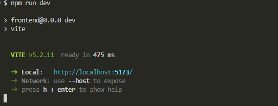

# Proyecto de Gestión de Biblioteca


## Requisitos para poner en marcha la aplicación
Tener instalado lo siguiente en la máquina:

- Node.js: [Descargar e instalar Node.js](https://nodejs.org)
- Enlace directo: [descarga directa para windows](https://nodejs.org/dist/v20.15.0/node-v20.15.0-x64.msi)
- npm: se utiliza para instalar las dependencias del proyecto. npm se instala automáticamente con Node.js

## Pasos para poner en marcha la aplicación

1. crear la base de datos con el nombre de "bibliotecatest"


2. desde la terminal navega al directorio del proyecto:

```
cd gestionBiblioteca-main
```

3. Instala las dependencias del frontend:

```
cd frontend
npm install
```

4. Vuelve al directorio principal del proyecto:

```
cd ..
```

5. Instala las dependencias del backend:

```
cd backend
npm install
```

6. Inicia el servidor backend:

```
npm run dev
```

7. Abre otra terminal y navega al directorio del frontend:

```
cd frontend
```

8. Inicia la aplicación frontend:

```
npm run dev
```

Una vez completados estos pasos, la aplicación estará disponible en la dirección que se muestra en la terminal.

igual o similar a la de esta imagen:




